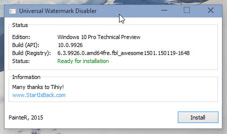

# Universal Watermark Disabler
Removes watermarks strings in Windows 10, Windows 8.1 and Windows 8 ([Preview](docs/preview.md)).

## About source
This utility was written by me in 2015, but only now I have published its source code.

## Features
- Removes watermark strings: BootSecure, Test Mode, Build string in evaluation and pre-release builds, "Confidential" warning text and even the build hash (for internal builds).
- Supports all builds from Windows 8 7850 to Windows 10 10240 (and newer).
- Supports any UI language.
- Does not delete branding strings (i.e. does not modify system files: work as proxy/injector).

## How does it work?
Short answer: COM-hijacking and DLL-Proxying with inject a DLL into the ExplorerFrame.

You can also read the article is about how this utils was researched: [Reverse-engineered the Universal Watermark Disabler](https://github.com/0xda568/Universal-Watermark-Disabler-Reverse-Engineering).

## Issues
The legacy implementation is incompatible with StartIsBack.

## History
In the far far past I was interested in beta versions of Windows, but the non-disable watermark in them did not allow me to make a beautiful screenshot, so I had the idea to remove the watermark.

Some of [changelog](docs/changelog.md).

## Special thanks
Special thanks to my old friend Tihiy - author of the [StartIsBack](https://www.StartIsBack.com/) project.
